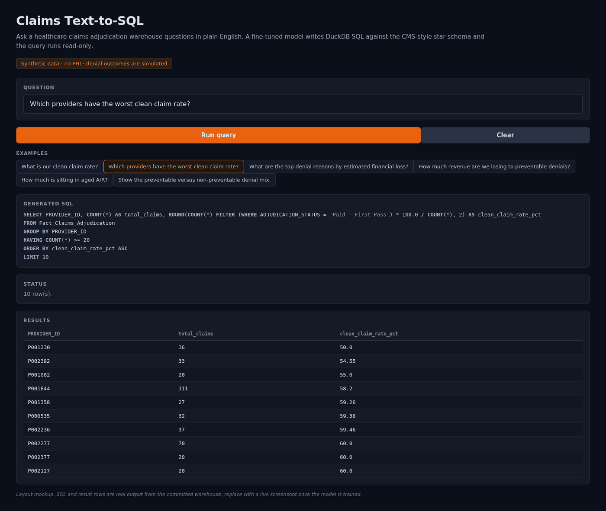

# Claims Text-to-SQL

**Ask a healthcare claims warehouse questions in plain English. A 1.5B model fine-tuned on one schema's business definitions writes the SQL, and the query runs read-only against the warehouse.**



<sub>Layout mockup. The SQL and result rows are real output from the committed warehouse; a model did not generate that query. Replace with a live screenshot after training — see `assets/README.md`.</sub>

The point of this project is not that a language model can write SQL. Every model can write SQL. The point is that on a schema like this one, writing *syntactically valid* SQL and writing *correct* SQL are different problems, and the gap between them is where a fine-tune earns its place.

Ask a general model "which providers have the worst clean claim rate." It will return something. It will group by provider, count rows, divide, and sort ascending — and it will be wrong, because it does not know that a clean claim is specifically `ADJUDICATION_STATUS = 'Paid - First Pass'` rather than any of the other things "clean" might mean, and it does not know that the ranking carries a minimum-volume floor. Without the floor, the top of the league table fills with providers who submitted three claims and had two denied. That is a 33% clean claim rate and it is noise, not a performance problem.

None of that is in the schema. It lives in dbt models, in a data dictionary, in the head of whoever built the warehouse. This project puts it in the weights.

## Results

<!-- RESULTS:START -->

| Backend | Overall | Paraphrase | Composition | Novel shape | p50 latency |
|---|---:|---:|---:|---:|---:|
| gold (harness check) | 100.0% | 100% | 100% | 100% | 0 ms |

<sub>n = 17 held-out questions. Backends measured in this run: gold (harness check). Regenerate with `python eval/run_eval.py --backends ... --save && python eval/update_readme.py`.</sub>

<!-- RESULTS:END -->

**Only the `gold` row is measured.** The model rows are absent rather than estimated, because there is no honest way to fill them without running the models, and a table of plausible-looking invented numbers would destroy the only thing this section is for. Run this to populate them:

```bash
python eval/run_eval.py --backends gold finetuned base anthropic --save
python eval/update_readme.py
```

The second command rewrites the table above in place from the saved JSON, so the published numbers and the measured numbers cannot drift apart.

Three things about this table are load-bearing.

**`gold` must read 100%.** It is an oracle backend that replays the reference SQL. If it scores anything else, the comparator is broken and no other row in the table means anything. It runs first for that reason.

**The baseline is not handicapped.** The base model is the same checkpoint the fine-tune started from, prompted through its own chat template, given the identical schema *and* the identical business-rule block. Starving the baseline of the definitions would guarantee the fine-tune wins and would prove nothing. If the fine-tune still wins with both models fully informed, the result is about the model rather than about the prompt.

**The frontier row is the honest question.** A reader is entitled to ask why anyone would run a 1.5B model locally when a much larger one is an HTTP call away. There are real answers — cost per query, latency, and the fact that a claims schema is not something every organisation will send to a third-party API — but the accuracy comparison should be published either way. If Sonnet wins outright, that belongs in this table.

At n=17 held-out questions, a few points of difference is noise. The category breakdown and the failure taxonomy carry more signal than the headline number.

## How the evaluation works

Execution accuracy: run the generated query, run the reference query, compare the result sets. Not string similarity — two correct queries can differ in aliases, join order, and subquery style, and scoring those as failures makes the metric useless.

The comparator ignores column order, column names, and row order, and tolerates floating-point difference in the last decimal. It enforces row order when the reference query has an `ORDER BY`, because "the worst ten providers" is meaningless unsorted. `eval/test_compare.py` tests both directions: cosmetic rewrites must pass, and four specific semantic errors — dropping the volume floor, using the wrong status string, sorting the wrong way, counting denials instead of clean claims — must be caught.

Held-out questions are split three ways, because one aggregate number hides the difference between memorising and generalising:

| Category | n | What it tests |
|---|---:|---|
| `paraphrase` | 6 | Same question as training, different words |
| `composition` | 5 | Two trained concepts combined (a KPI filtered by claim type) |
| `novel_shape` | 6 | Query structures absent from training — window functions, quantiles, cohort comparison |

Failures are classified rather than just counted:

| Kind | Meaning |
|---|---|
| `no_sql` | Model produced nothing parseable |
| `blocked` | Rejected by the read-only guard |
| `sql_error` | Ran and threw |
| `wrong_result` | **Ran, returned a plausible number, and the number was wrong** |

That last one is the category to read. A query that crashes is annoying; a query that returns a confident wrong figure to someone building a board deck is the actual risk, and on a business-metric schema it is precisely what not knowing the definitions produces.

## The schema

A star schema mirroring the marts in [Medical-Insurance-Claims-And-Denial-Analytics](https://github.com/hariharan-sabapathi/Medical-Insurance-Claims-And-Denial-Analytics), with identical table and column names so a model fine-tuned here serves that warehouse without retraining.

```
Dim_Patient(PATIENT_ID, BIRTH_DT, DEATH_DT, SEX, BENE_RACE_CD, SP_STATE_CODE,
            AGE_APPROX, CHRONIC_CONDITION_COUNT, SNAPSHOT_YEAR)
Dim_Provider(PROVIDER_ID, ATTENDING_NPI, CLAIM_VOLUME)
Dim_Diagnosis(DIAGNOSIS_CODE, CODE_SYSTEM, DIAGNOSIS_CATEGORY_APPROX, DESCRIPTION)
Dim_CARC_Denials(CARC_CODE, DESCRIPTION, PREVENTABILITY_BUCKET)
Fact_Claims_Adjudication(CLAIM_ID, PATIENT_ID, PROVIDER_ID, DIAGNOSIS_CODE, CARC_CODE,
                         CLAIM_TYPE, CLM_FROM_DT, CLM_THRU_DT, BILLED_PAID_AMT,
                         PRIMARY_PYR_PD_AMT, ADJUDICATION_STATUS,
                         DAYS_SINCE_SUBMISSION, AR_AGING_BUCKET)
```

The definitions the model has to learn, which appear nowhere in that DDL:

- A claim is clean when `ADJUDICATION_STATUS = 'Paid - First Pass'`.
- **Denied claims have `BILLED_PAID_AMT = 0` by construction** — a $0 payment is what marks a claim denied in the first place. So "how much did denials cost us" cannot be answered by summing that column. It has to be proxied by the average paid amount of first-pass-paid claims of the same claim type. A model that sums `BILLED_PAID_AMT` over denied claims returns zero, which is wrong and looks like an answer.
- Provider league tables need `HAVING COUNT(*) >= 20`.
- Preventable denials are `PREVENTABILITY_BUCKET LIKE 'Preventable%'` in the CARC dimension.
- Aged A/R means `AR_AGING_BUCKET = '90+'`.

CARC codes are real X12 Claim Adjustment Reason Codes. `197` is missing prior authorization, `18` is an exact duplicate, `29` is untimely filing. Their preventability classification is this project's, using the same keyword taxonomy as the source warehouse.

## What the data is, and is not

**Synthetic. No PHI. Denial outcomes are simulated.**

By default `warehouse.py` generates the warehouse itself — 40,000 claims, 2,666 providers, 3,333 patients — so the repo clones and runs without a large download. Distributions are chosen to make the business rules meaningful: provider volume follows a power law with a long tail of low-volume providers, which is the condition that makes the minimum-volume floor necessary.

Point it at the real CMS DE-SynPUF extracts instead by dropping them in `data/raw/` (see the README there). DE-SynPUF is itself synthetic, published by CMS. Even there, denial status is simulated rather than observed — the source files carry no adjudication field, so a claim is treated as denied when Medicare paid $0 and a CARC code is sampled from a realistic denial mix. The upstream warehouse project makes the same call and documents it the same way.

What follows from that: **no number this app produces describes real payer behaviour.** The denial mix is a model of a denial mix. The schema, the joins, and the business definitions are real; the outcomes are not. Anyone reading a figure off this dashboard should know which half they are looking at.

## Setup

```bash
git clone <this repo> && cd claims-text-to-sql
python -m venv .venv && source .venv/bin/activate   # .venv\Scripts\activate on Windows
pip install -r requirements.txt
cp .env.example .env
```

```bash
python warehouse.py           # build the DuckDB warehouse
python prepare_dataset.py     # generate + validate train/eval splits
python eval/test_compare.py   # comparator self-test — must pass before trusting any eval
python eval/run_eval.py --backends gold
```

That last command needs no model and no GPU. It confirms the harness is sound before you spend a Colab session on training.

Then fine-tune in `train.ipynb` (free T4 is enough), set `FINETUNED_MODEL` in `.env`, and:

```bash
python app.py                    # Gradio at http://127.0.0.1:7860
uvicorn api:app --reload         # FastAPI at http://127.0.0.1:8000/docs
```

## How it fits together

```
schema.py          Star schema DDL, real CARC codes, business definitions
warehouse.py       Builds DuckDB (synthetic or DE-SynPUF); read-only execution guard
prompt.py          THE prompt format — training and inference both call it
prepare_dataset.py 158 validated pairs + 17 held-out eval questions
train.ipynb        QLoRA SFT on Colab
models.py          Four backends behind one interface: gold, finetuned, base, anthropic
inference.py       Serving path — same prompt.py the training used
app.py             Gradio UI
api.py             FastAPI read API
eval/compare.py    Result-set comparison
eval/run_eval.py   Execution accuracy, category breakdown, failure taxonomy
eval/test_compare.py  Tests for the comparator itself
eval/update_readme.py Rewrites the results table above from a saved run
```

Two things in that list are there because of specific bugs in the inventory version of this project, and they're worth naming since the same mistakes are easy to repeat.

**`prompt.py` exists to stop train/serve skew.** In the inventory version, `prepare_dataset.py` wrote training examples as `"...Question: {q}\n{sql}"` while `inference.py` sent a chat-templated system prompt with few-shot examples. The formats never matched, so at inference time the model was being asked for something it had never been trained to produce — the fine-tune was largely bypassed and the base model's general ability was doing the work. That is invisible without an eval, which is part of why the eval matters. Here there is one function, called from three places.

**`prepare_dataset.py` executes every pair before writing it.** The inventory dataset shipped a `SELECT category, name, MIN(unit_price) ... GROUP BY category`, which returns a name from an arbitrary row rather than the name of the cheapest product. It runs, it looks right, and it teaches the model to write the same bug. Every pair here is executed against the warehouse first, and anything that fails is dropped and reported.

## Related

- [Medical-Insurance-Claims-And-Denial-Analytics](https://github.com/hariharan-sabapathi/Medical-Insurance-Claims-And-Denial-Analytics) — the warehouse this queries. PySpark ingestion, dbt marts, Power BI denial control tower.
- [clinical-retrieval](https://github.com/hariharan-sabapathi/clinical-retrieval) — the unstructured counterpart. BM25 retrieval over clinical notes, evaluated with bootstrap CIs.
- [Finance-Intelligence-Agent](https://github.com/hariharan-sabapathi/Finance-Intelligence-Agent) — the other natural-language-to-SQL project, and the deliberate contrast. That one routes a hosted model through tool-calling with no fine-tune, which is the right design when the schema is simple and the definitions are obvious. This one exists because that approach loses on a schema where they aren't.
